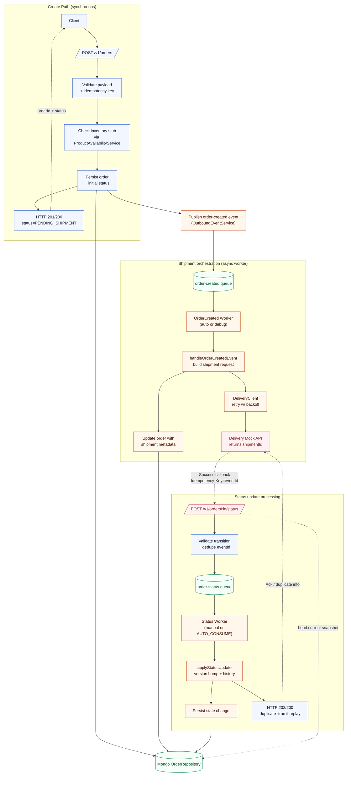

# Sales Service Design

## Implementation Rationale
- **Fastify + TypeScript** – chosen for its performance-minded HTTP core, first-class schema validation, and excellent developer ergonomics with type safety. The lightweight plugin model keeps latency low while still letting us bolt on concerns like rate limiting and health probes without heavy middleware stacks.
- **MongoDB** – document persistence matches the shape of an order aggregate and allows flexible enrichment (status history, shipment metadata) without complex joins. Built-in TTL/index tooling simplifies idempotency-key enforcement.
- **Outbound queues + workers** – splitting create/status flows from shipment orchestration keeps the request path fast while enabling retries and eventual consistency. An in-memory SQS mock preserves the contract for future managed queue adoption.
- **Delivery mock service** – provides deterministic integration testing and local dev feedback without needing real downstream dependencies. This mirrors the production contract through HTTP + idempotency headers.
- **Rate limiting with optional Redis backing** – `@fastify/rate-limit` lets us enforce tenant or global throughput controls. Redis acts as a distributed counter store in deployments that need horizontal scaling; the in-memory fallback keeps setup simple for dev.

## Context & Goals
- Provide the Sales microservice that owns order intake, persistence, idempotency, delivery initiation, and state transitions.
- Integrate with MongoDB for durable storage and a mocked Delivery service over HTTP.
- Expose REST APIs that satisfy the assignment hand-off, ship with strong idempotency semantics, and run in Node.js (Fastify + TypeScript).
- Package the service for local development and deployment via Docker / docker-compose, supplying health probes and configuration via environment variables.

## Non-Goals
- Security hardening such as authentication, authorization, mTLS, or secret rotation.
- Full Delivery implementation (stubbed HTTP service only) and downstream observability (metrics, tracing dashboards).
- Advanced scaling features like sharding, partitioned event sourcing, or multi-region conflict resolution (documented for future work only).

## Architecture Overview
### Components
- **Fastify HTTP layer** – request validation, routing, error handling, and health endpoints.
- **OrderService** – core domain logic for create/read/status update operations, idempotency enforcement, and async shipment orchestration via queue-driven workers.
- **ProductAvailabilityService** – stubbed inventory checker that blocks orders when quantities exceed configured thresholds, providing a seam for future real integration.
- **OrderRepository** – MongoDB persistence layer managing indexes, optimistic concurrency via `version`, and document mapping.
- **DeliveryClient** – outbound HTTP client with exponential backoff + jitter retries for `POST /v1/shipments`.
- **OutboundEventService** – publishes domain events (e.g., `ORDER_CREATED`) to a queue abstraction; defaults to an in-memory SQS mock for this exercise.
- **Queue Consumers (debug)** – in-memory workers used during development/tests to drain both the order-created and status-update queues so shipment creation and status transitions happen off the request path.
- **Debug Routes** – expose the in-memory queue store for inspection/maintenance (`GET /debug/queues/order-created`, `GET /debug/queues/order-status`, `DELETE /debug/queues/order-created`, `DELETE /debug/queues/order-status`) and simulate worker consumption (`POST /debug/queues/order-created/process`, `POST /debug/queues/order-status/process`).
- **Queue Workers (dev helper)** – optional in-process pollers enabled via `AUTO_CONSUME_STATUS_QUEUE=true` to automatically drain the order-created and status queues during local development.
- **Delivery Mock** – lightweight Fastify application (separate container) returning deterministic shipment IDs for local/dev workflows.
- **Rate Limit Plugin** – wraps `@fastify/rate-limit` to enforce global throttling and route-specific limits with structured logging; supports in-memory or Redis-backed counters.

### Request Lifecycle
1. **Create Order** (`POST /v1/orders`)
   1. Fastify validates headers/body; extracts `Idempotency-Key`.
   2. `OrderService.createOrder` computes payload hash, checks existing records, invokes the availability stub to ensure inventory can satisfy the request, persists the order, publishes an `order-created` event to the queue abstraction, and emits the initial status history entry.
   3. Response returns `{ orderId, status }` immediately. The service publishes an `order-created` message; a worker consumes it asynchronously to call Delivery and attach shipment metadata once the HTTP request completes.
2. **Fetch Order** (`GET /v1/orders/{orderId}`)
   - Repository returns the stored document including metadata (`requestId`, `payloadHash`, `statusHistory`, `shipment`).
3. **Status Update** (`POST /v1/orders/{orderId}/status`)
   1. Delivery mock sends callback with `Idempotency-Key` (treated as `eventId`) and body `{ status, at }`.
   2. Request is validated for duplicates/monotonic transitions and then enqueued on the `order-status` queue.
   3. A lightweight worker (simulated via debug route / queue consumer) dequeues messages and invokes `OrderService.applyStatusUpdate`, ensuring the actual write happens off the critical request path.

### Order Processing Flow

## Data Model
`orders` collection (MongoDB):

| Field | Type | Description |
| --- | --- | --- |
| `id` | string (UUID) | Public order identifier. Unique index. |
| `customerId` | string | Business customer reference. |
| `items` | array `{ sku, qty }` | Order line items. `qty` ≥ 1. |
| `totalAmount` | number | Order total; validated > 0. |
| `status` | enum `PENDING_SHIPMENT|SHIPPED|DELIVERED` | Current lifecycle state. |
| `requestId` | string | Mirrors `Idempotency-Key`; unique index for dedupe. |
| `payloadHash` | string | Stable SHA-256 hash of create payload for conflict detection. |
| `createdAt` / `updatedAt` | ISO-8601 string | Audit timestamps. |
| `version` | number | Optimistic concurrency token incremented on status transitions. |
| `statusHistory` | array `{ eventId, status, at }` | Ordered log of lifecycle events (includes initial creation entry). |
| `shipment` | `{ shipmentId, state, requestedAt }` | Metadata from Delivery mock, populated asynchronously. |

Indexes:
- `{ id: 1 }` unique – ensures referential lookups.
- `{ requestId: 1 }` unique – enforces idempotent create semantics.

## APIs
### `POST /v1/orders`
- **Headers**: `Idempotency-Key` (required).
- **Body**: `{ customerId, totalAmount, items[{ sku, qty }] }`.
- **Response**: `201` on initial create / `200` on replay, payload `{ orderId, status: "PENDING_SHIPMENT" }`.
- **Errors**: `409` when payload hash mismatches existing idempotency key.

### `GET /v1/orders/{orderId}`
- **Response**: `200` with full order document (including idempotency metadata, status history, shipment info).
- **Errors**: `404` when order missing.

### `POST /v1/orders/{orderId}/status`
- **Headers**: `Idempotency-Key` (eventId).
- **Body**: `{ status: "SHIPPED"|"DELIVERED", at: ISO-8601 string }`.
- **Response**: `202` when the event is accepted for asynchronous processing; `200` with `{ accepted: false, duplicate: true }` when the event was already applied.
- **Errors**: `404` (unknown order), `409` (invalid transition).

### Outbound `POST /v1/shipments` (Delivery Mock)
- **Request**: `{ orderId, customerId, totalAmount, items[] }` with `Idempotency-Key` header equal to order `requestId`.
- **Response**: `{ shipmentId, state: "CREATED" }`.
- Failures trigger retries with exponential backoff but do not block the client response.

## Idempotency & Consistency
- **Create**: Existing record located by `requestId`. Matching `payloadHash` returns the stored order; mismatched hash → `409 Conflict`. Initial status event stored with unique synthetic `eventId`.
- **Status updates**: `Idempotency-Key` is treated as `eventId`. Updates short-circuit if the event already exists in `statusHistory`. Transitions must follow `PENDING_SHIPMENT → SHIPPED → DELIVERED`; monotonicity enforced in service layer. Writes rely on `version` to detect lost updates; on conflict we refetch to confirm dedupe before returning error.
- **Shipment scheduling**: Driven by the order-created queue. Workers fetch the latest order snapshot, skip when metadata already exists, and retry on Delivery failures before persisting shipment details (no version bump).

## Retry & Backoff Strategy
- Delivery calls are wrapped in `executeWithRetry` with exponential backoff + full jitter. Default config: base delay 200 ms, max retries 3, per-request timeout 5 s (AbortController). Only HTTP 5xx/429 or transport errors are retried; client/validation errors fail fast. Each retry logs attempt count and delay.

## Configuration
Validated on boot via `env-schema`:
- `PORT` / `HOST`
- `MONGO_URI`, `MONGO_DB_NAME`
- `DELIVERY_BASE_URL`, `DELIVERY_TIMEOUT_MS`, `DELIVERY_MAX_RETRIES`, `DELIVERY_RETRY_BASE_DELAY_MS`
- `ORDER_CREATED_QUEUE`
- `.env.example` documents required defaults. Invalid or missing values cause startup failure.

## Testing Strategy
- **Integration (Vitest)**: `test/orders.e2e.test.ts` spins up MongoMemoryServer & delivery mock to exercise create/read/update flows, idempotency, shipment metadata, availability failures, queue publishing, and invalid transitions.
- **Unit**: Core logic (hashing, retry) is deterministic and covered implicitly through integration. Additional unit suites can be added for finer-grained validation if time allows.
- **Manual verification**: `npm run dev` starts Fastify with hot reload (`ts-node-dev`); `/healthz` and `/readyz` endpoints support health checks.
- **Performance smoke**: `npm run perf:orders` uses `autocannon` to stress the create-order path with unique idempotency keys, validating that persistence and queue publishing stay responsive at higher concurrency.
- Future work: add load smoke (`autocannon`) and contract tests for Delivery client.

## Deployment
- Multi-stage `Dockerfile` produces production image (Node 20 slim). Build stage compiles TypeScript (`npm run build`) then prunes dev deps; runtime stage ships compiled `dist/` only.
- `docker-compose.yml` orchestrates:
  - `sales-service` (this app)
  - `mongodb` (MongoDB 7)
  - `delivery-mock` (Fastify stub from `delivery-mock/` directory)
- Volumes persist Mongo data; ports expose service (`3000`) and mock delivery (`4000`).
- Runtime command: `node dist/server.js`; health endpoints: `/healthz`, `/readyz`.

## Future Enhancements
- Replace synchronous HTTP Delivery integration with message broker (Kafka/SQS) and outbox pattern.
- Add authentication (JWT), request signing, and comprehensive observability (metrics, tracing).
- Implement event log collection for audit trail and replay, plus multi-region replication/conflict resolution.
