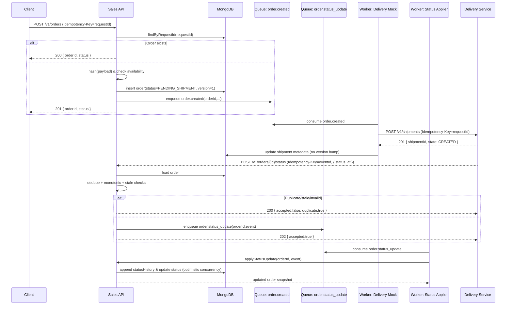

# Order Processing Sequence

```mermaid
sequenceDiagram
    participant C as Client
    participant S as Sales API
    participant DB as MongoDB
    participant QC as Queue: order.created
    participant QS as Queue: order.status_update
    participant W1 as Worker: Delivery Mock
    participant W2 as Worker: Status Applier
    participant D as Delivery Service

    C->>S: POST /v1/orders (Idempotency-Key=requestId)
    S->>DB: findByRequestId(requestId)
    alt Order exists
        S-->>C: 200 { orderId, status }
    else
        S->>S: hash(payload) & check availability
        S->>DB: insert order(status=PENDING_SHIPMENT, version=1)
        S->>QC: enqueue order.created(orderId,...)
        S-->>C: 201 { orderId, status }
    end

    %% Delivery creation path
    W1->>QC: consume order.created
    W1->>D: POST /v1/shipments (Idempotency-Key=requestId)
    D-->>W1: 201 { shipmentId, state: CREATED }
    W1->>DB: update shipment metadata (no version bump)

    %% Callback path
    D-->>S: POST /v1/orders/{id}/status (Idempotency-Key=eventId, { status, at })
    S->>DB: load order
    S->>S: dedupe + monotonic + stale checks
    alt Duplicate/stale/invalid
        S-->>D: 200 { accepted:false, duplicate:true }
    else
        S->>QS: enqueue order.status_update(orderId,event)
        S-->>D: 202 { accepted:true }
    end

    %% Apply status update
    W2->>QS: consume order.status_update
    W2->>S: applyStatusUpdate(orderId, event)
    S->>DB: append statusHistory & update status (optimistic concurrency)
    S-->>W2: updated order snapshot
```
