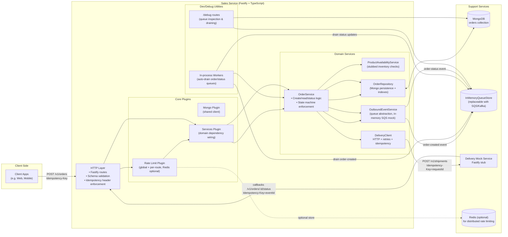

# Order Processing System Overview

The diagram below summarizes the Sales service, supporting infrastructure, and the asynchronous flows that power order creation and delivery tracking.

## Capability Highlights
- **Resilient intake**: Idempotent REST APIs, schema validation, rate limiting, and optimistic locking guard against retries and abuse.
- **Async orchestration**: Order-created events fan out to workers that call the Delivery service with retries, keeping the request path fast.
- **Status lifecycle**: Delivery callbacks enqueue status updates, preserving ordering and idempotency before appending to Mongo.
- **Debuggability**: Dedicated `/debug` routes, queue inspectors, and optional auto-draining workers simplify demos and tests.
- **Swap-friendly design**: In-memory queue and delivery mock mimic SQS/real downstreams, making it clear how production dependencies would slot in.
- **Configurable limits**: Rate limiting supports memory or Redis stores, highlighting readiness for horizontal scaling.
